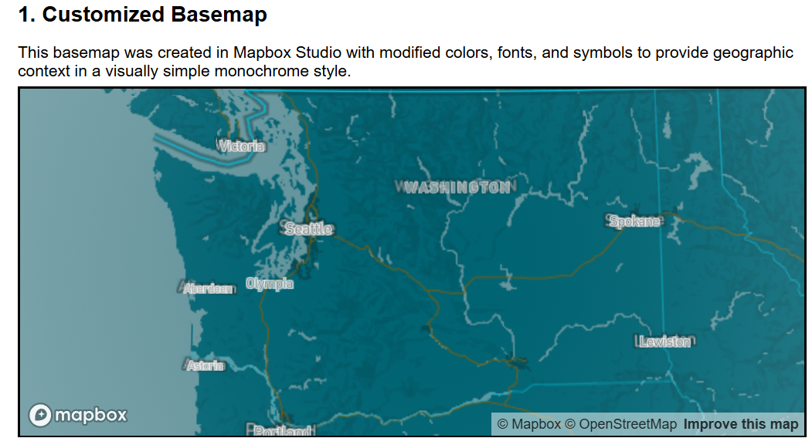
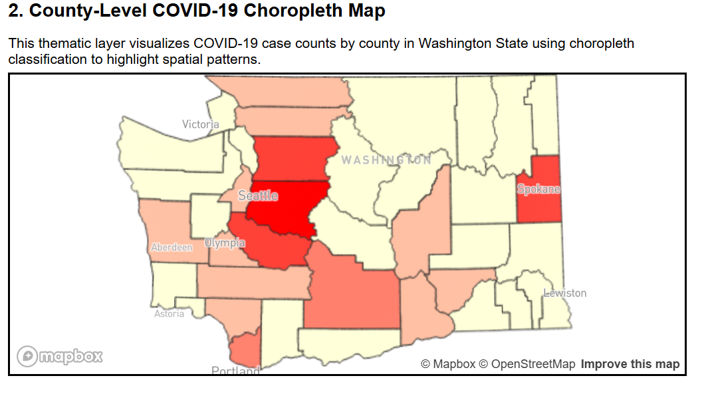
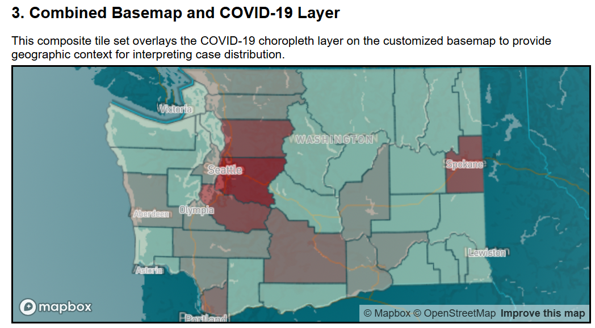
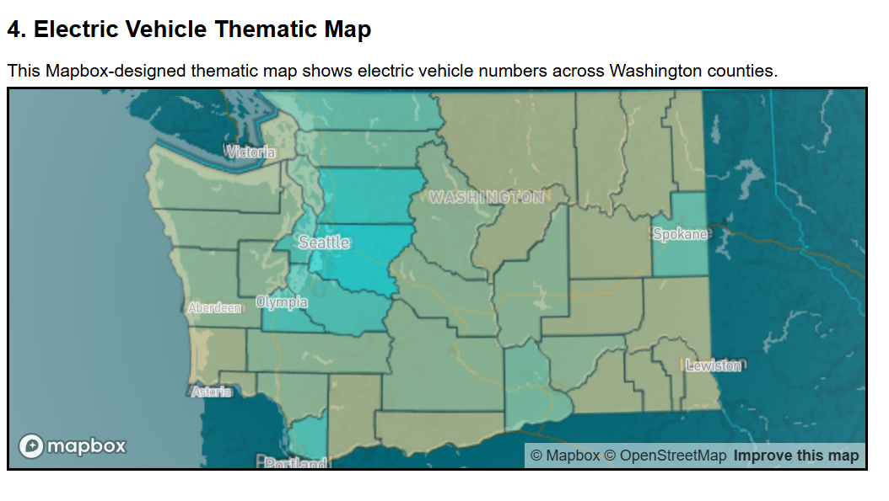

# Lab 4 – Custom Map Tiles and Web Map

## Web Map URL
The web map can be accessed here:  
https://fredand04.github.io/lab4-jagstiles/

## Screenshots of Tile Layers

### Tile Set 1 – Customized Basemap

A customized basemap created in Mapbox Studio with modified colors, labels, and symbols. I could not get the standard monochrome map to work with QGIS so I went with this on the fly.

### Tile Set 2 – COVID-19 Choropleth Layer

A raster tile layer visualizing COVID-19 case counts by county in Washington State using a choropleth theme.

### Tile Set 3 – Combined Basemap + COVID Layer

A tile set combining the customized basemap with the COVID-19 thematic layer to support context of spatial patterns.

### Tile Set 4 – Electric Vehicle Theme Map

A thematic map visualizing electric vehicle owners across Washington counties using a custom map with custom colors and labels.

## Examined Geographic Area
The examined geographic area is Washington State in the U.S. 
I used County-level spatial datasets to visualize COVID-19 cases and electric vehicle owners.

## Available Zoom Levels
The raster tile sets were difficult to download and due to limited computer storage only managed this much:

- Minimum zoom level: 3  
- Maximum zoom level: 10  